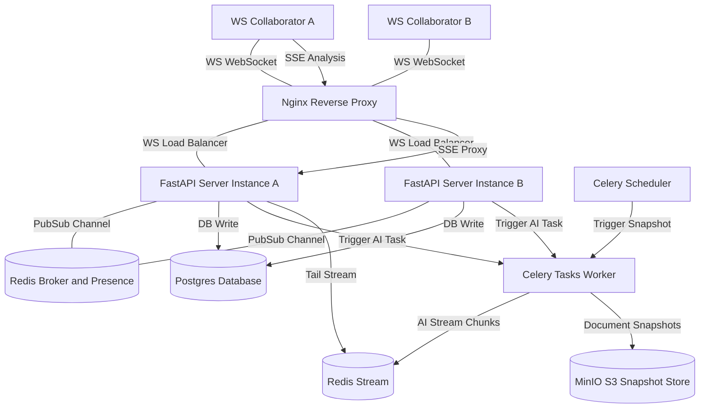

# CollabStream: Real-Time Document Room API with Operational Transform & SSE AI Stream

**CollabStream** is a production-ready, horizontally scalable real-time collaborative document platform. It supports concurrent editing via a custom **Operational Transform (OT) conflict resolution engine**, tracks online users via a **Redis presence system**, streams debounced real-time document critique using **Celery & Server-Sent Events (SSE)**, backs up periodic versions to **S3-compatible storage**, and provides professional-grade observability with **Prometheus** metrics and **OpenTelemetry** trace exports.

---

## 1. System Architecture & Flow



### Core Collaboration Flow
1. **Handshake & Auth**: A client upgrades their HTTP connection to a WebSocket at `ws://localhost/ws/doc/{room_id}?token={jwt_token}`. The connection is validated, and the user's presence is registered in Redis.
2. **Real-time Synchronization (OT)**: When Client A edits, they send an operational delta: `{ op: "insert", pos: 10, chars: "hello", revision: 5 }`.
3. **Conflict Resolution**: The FastAPI node locks the document row using `SELECT FOR UPDATE`. If concurrent edits have bumped the server's revision to `8`, the server automatically transforms the incoming delta against operations `6, 7, 8`, applies the transformed edit, logs it, and broadcasts it to all nodes via **Redis Pub/Sub**.
4. **Multiplexed Broadcast**: The pub/sub channels ensure that other connected FastAPI instances receive the edit and push it to their respective local clients instantly.
5. **Debounced AI stream**: Edits reset a `0.8-second` Redis debounce timer. When the typing pauses, Celery dispatches a task to request a streaming review from OpenAI/Anthropic. The worker streams response chunks directly into a **Redis Stream**.
6. **SSE Announcers**: The client listens to the `/api/sse/analysis/{room_id}` SSE endpoint. FastAPI tails the Redis stream via `XREAD` and pushes text chunks to the client.
7. **S3 Backups**: Celery Beat runs every 60 seconds, serializing latest revisions and archiving them to MinIO (S3-compatible) storage.

---

## 2. Technology Stack & Observability

| Layer | Technology | Role |
| :--- | :--- | :--- |
| **Core Web API** | FastAPI + Starlette | WebSockets, SSE & REST API Gateway |
| **Pub/Sub & Cache** | Redis 7 | Event fan-out, presence heartbeats, AI streams, & Celery broker |
| **Database** | PostgreSQL 15 + SQLAlchemy (Asyncpg) | Schema persistence & transactional OT history logs |
| **Task Queue** | Celery 5 + Celery Beat | Debounced AI completions & periodic MinIO backups |
| **Object Storage** | MinIO (S3 API Mock) | Immutable document snapshot archives |
| **Reverse Proxy** | Nginx | WebSocket connection upgrade gateway & SSE buffering bypass |
| **Observability** | Prometheus + OpenTelemetry | Metrics collection (scrapes `/metrics`) & Jaeger trace exports |

---

## 3. Getting Started

### Prerequisites
- Docker & Docker Compose
- A command-line client like `curl` or HTTP client, and `wscat` or a browser tool for WebSockets.

### Running the Services
To spin up the entire cluster (FastAPI Gateway, Celery Workers, Postgres, Redis, MinIO, Nginx, Prometheus, and Jaeger) run:

```bash
# Clone or step into the document-room folder and boot
docker-compose up --build -d
```

To configure live OpenAI/Anthropic APIs instead of the built-in out-of-the-box simulated stream, inject your key on boot:
```bash
OPENAI_API_KEY="your-key-here" docker-compose up --build -d
```

### Access Ports & Services
- **Nginx HTTP / WebSocket Gateway**: `http://localhost` (Port 80)
- **Postgres Database**: `localhost:5432`
- **Redis Broker**: `localhost:6379`
- **MinIO S3 Console**: `http://localhost:9001` (user: `miniouser` / password: `miniopassword`)
- **Jaeger Traces UI**: `http://localhost:16686`
- **Prometheus Metrics UI**: `http://localhost:9090`

---

## 4. REST API & WebSocket Usage Guide

### A. Authentication & Sign Up
First, register a user and log in to obtain a JWT token:

```bash
# 1. Create a Collaborator Account
curl -X POST http://localhost/api/auth/signup \
  -H "Content-Type: application/json" \
  -d '{"email": "farhad@example.com", "password": "securepassword123", "full_name": "Farhad Dev"}'

# 2. Authenticate and Obtain JWT
curl -X POST http://localhost/api/auth/login \
  -H "Content-Type: application/json" \
  -d '{"email": "farhad@example.com", "password": "securepassword123"}'
```

Output:
```json
{
  "access_token": "eyJhbGciOiJIUzI1NiIsIn...",
  "token_type": "bearer"
}
```
*Note: Copy the `access_token` for subsequent REST and WebSocket requests.*

---

### B. Document Management (REST)
Create a collaborative document room:

```bash
# 3. Create a Document Room (Send Authorization: Bearer <token>)
curl -X POST http://localhost/api/documents/ \
  -H "Authorization: Bearer <your_jwt_token>" \
  -H "Content-Type: application/json" \
  -d '{"title": "CollabStream Production Plan"}'
```

Output:
```json
{
  "id": 1,
  "title": "CollabStream Production Plan",
  "content": "",
  "revision": 0,
  "created_at": "2026-05-19T12:00:00",
  "updated_at": "2026-05-19T12:00:00"
}
```

---

### C. Live Document Collaboration (WebSockets)
Connect a client to the WebSocket stream using your favorite WebSocket client CLI (`wscat`):

```bash
# 4. Connect to Room 1 (Nginx proxies the WebSocket handshake)
wscat -c "ws://localhost/ws/doc/1?token=<your_jwt_token>"
```

#### Client to Server Payloads:
Once connected, send edits (OT deltas).
Each delta specifies an `op` (`insert` or `delete`), zero-indexed `pos`, characters edited `chars`, and the `revision` the client is editing:

* **Send an edit (inserting "Hello " at start)**:
```json
{
  "event_type": "delta",
  "delta": {
    "op": "insert",
    "pos": 0,
    "chars": "Hello ",
    "revision": 0
  }
}
```

* **Send cursor movement (Premium cursor presence tracking)**:
```json
{
  "event_type": "cursor",
  "cursor_pos": 6
}
```

* **Heartbeat (Send every 10s to keep presence alive)**:
```json
{
  "event_type": "heartbeat"
}
```

#### Server to Client Broadcasts:
Other clients will instantly receive:
- **Join/Leave notifications** with complete room rosters:
```json
{
  "event_type": "user_joined",
  "user_id": 1,
  "email": "farhad@example.com",
  "users": [
    { "user_id": 1, "email": "farhad@example.com", "status": "online" }
  ]
}
```
- **OT conflict-resolved delta broadcasts** reflecting synchronized revision numbers:
```json
{
  "event_type": "delta_broadcast",
  "delta": {
    "op": "insert",
    "pos": 0,
    "chars": "Hello ",
    "revision": 1
  },
  "user_id": 1,
  "email": "farhad@example.com"
}
```

---

## 5. Server-Sent Events (SSE) AI Analysis Stream
Open a connection to receive real-time, debounced AI suggestions as you type:

```bash
# 5. Listen to the AI critique streaming channel
curl -N http://localhost/api/sse/analysis/1 \
  -H "Authorization: Bearer <your_jwt_token>"
```

FastAPI will tail the Redis stream and yield SSE frames:
```text
data: {"chunk": "[AI"}

data: {"chunk": " Analysis]"}

data: {"chunk": " Document"}

data: {"chunk": " analysis"}

data: {"chunk": " complete."}

data: [DONE]
```

---

## 6. Database Snapshots to S3
Celery Beat automatically backs up outstanding changes to S3/MinIO. You can also force an instant snapshot manually:

```bash
# 6. Request manual document S3 Snapshot backup
curl -X POST http://localhost/api/documents/1/snapshot \
  -H "Authorization: Bearer <your_jwt_token>"
```

Retrieve S3 metadata snapshot lists for Room 1:
```bash
# 7. List S3 backup snapshots history
curl http://localhost/api/documents/1/snapshots \
  -