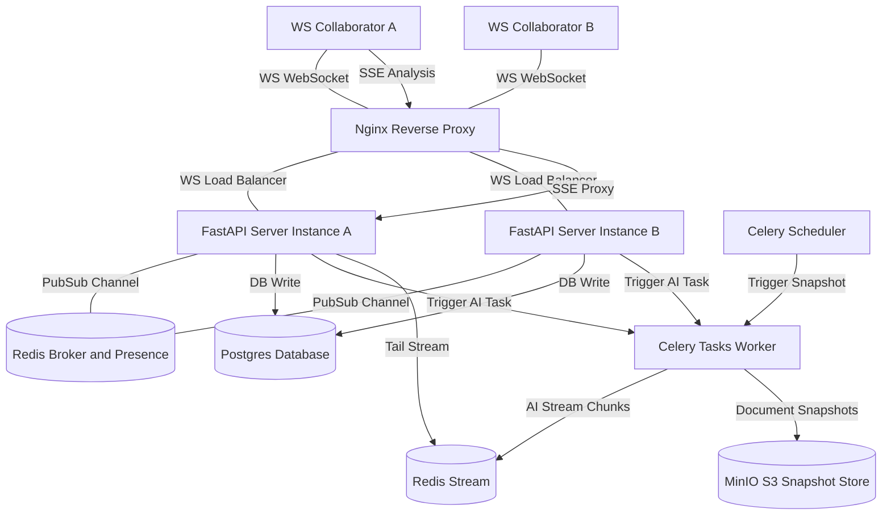

# CollabStream: Real-Time Document Room API with Operational Transform & SSE AI Stream

**CollabStream** is a production-ready, horizontally scalable real-time collaborative document platform. It supports concurrent editing via a custom **Operational Transform (OT) conflict resolution engine**, tracks online users via a **Redis presence system**, streams debounced real-time document critique using **Celery & Server-Sent Events (SSE)**, backs up periodic versions to **S3-compatible storage**, and provides professional-grade observability with **Prometheus** metrics and **OpenTelemetry** trace exports.

---

## 1. System Architecture & Flow



### Core Collaboration Flow
1. **Handshake & Auth**: A client upgrades their HTTP connection to a WebSocket at `ws://localhost/ws/doc/{room_id}?token={jwt_token}`. The connection is validated, and the user's presence is registered in Redis.
2. **Real-time Synchronization (OT)**: When Client A edits, they send an operational delta: `{ op: "insert", pos: 10, chars: "hello", revision: 5 }`.
3. **Conflict Resolution**: The FastAPI node locks the document row using `SELECT FOR UPDATE`. If concurrent edits have bumped the server's revision to `8`, the server automatically transforms the incoming delta against operations `6, 7, 8`, applies the transformed edit, logs it, and broadcasts it to all nodes via **Redis Pub/Sub**.
4. **Multiplexed Broadcast**: The pub/sub channels ensure that other connected FastAPI instances receive the edit and push it to their respective local clients instantly.
5. **Debounced AI stream**: Edits reset a `0.8-second` Redis debounce timer. When the typing pauses, Celery dispatches a task to request a streaming review from OpenAI/Anthropic. The worker streams response chunks directly into a **Redis Stream**.
6. **SSE Announcers**: The client listens to the `/api/sse/analysis/{room_id}` SSE endpoint. FastAPI tails the Redis stream via `XREAD` and pushes text chunks to the client.
7. **S3 Backups**: Celery Beat runs every 60 seconds, serializing latest revisions and archiving them to MinIO (S3-compatible) storage.

---

## 2. Technology Stack & Observability

| Layer | Technology | Role |
| :--- | :--- | :--- |
| **Core Web API** | FastAPI + Starlette | WebSockets, SSE & REST API Gateway |
| **Pub/Sub & Cache** | Redis 7 | Event fan-out, presence heartbeats, AI streams, & Celery broker |
| **Database** | PostgreSQL 15 + SQLAlchemy (Asyncpg) | Schema persistence & transactional OT history logs |
| **Task Queue** | Celery 5 + Celery Beat | Debounced AI completions & periodic MinIO backups |
| **Object Storage** | MinIO (S3 API Mock) | Immutable document snapshot archives |
| **Reverse Proxy** | Nginx | WebSocket connection upgrade gateway & SSE buffering bypass |
| **Observability** | Prometheus + OpenTelemetry | Metrics collection (scrapes `/metrics`) & Jaeger trace exports |

---

## 3. Getting Started

### Prerequisites
- Docker & Docker Compose
- A command-line client like `curl` or HTTP client, and `wscat` or a browser tool for WebSockets.

### Running the Services
To spin up the entire cluster (FastAPI Gateway, Celery Workers, Postgres, Redis, MinIO, Nginx, Prometheus, and Jaeger) run:

```bash
# Clone or step into the document-room folder and boot
docker-compose up --build -d
```

To configure live OpenAI/Anthropic APIs instead of the built-in out-of-the-box simulated stream, inject your key on boot:
```bash
OPENAI_API_KEY="your-key-here" docker-compose up --build -d
```

### Access Ports & Services
- **Nginx HTTP / WebSocket Gateway**: `http://localhost` (Port 80)
- **Postgres Database**: `l